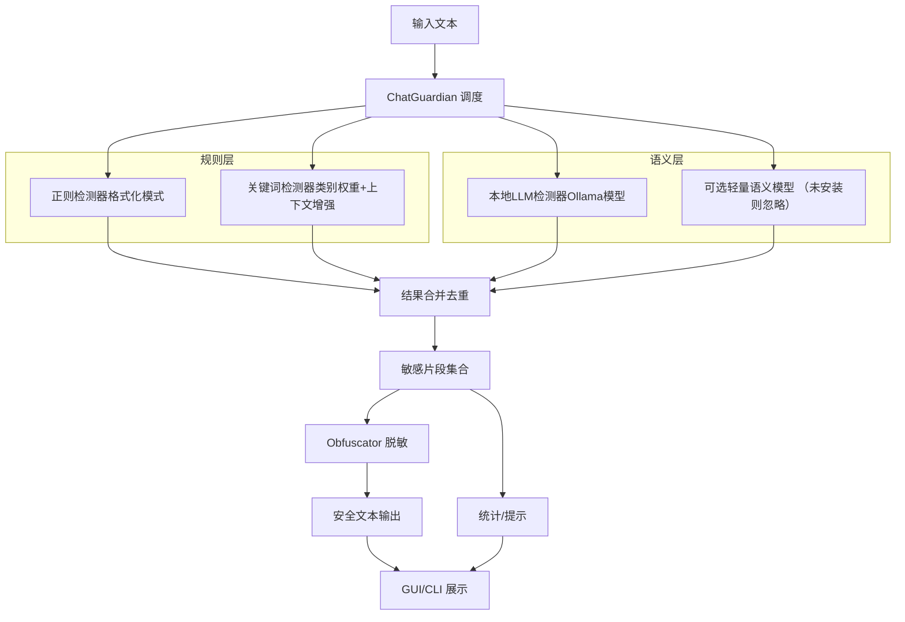
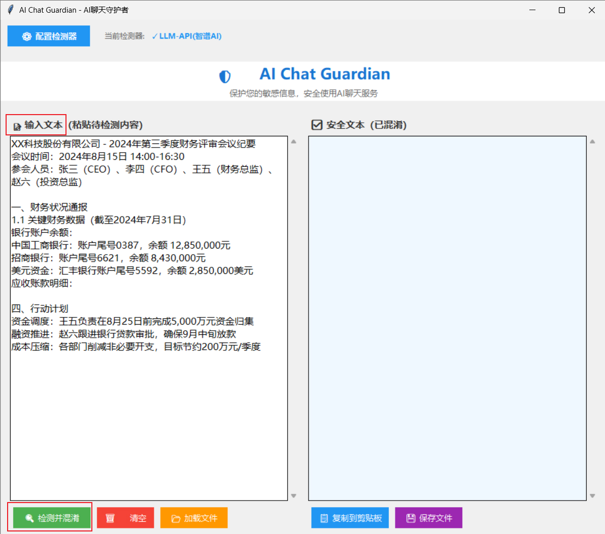
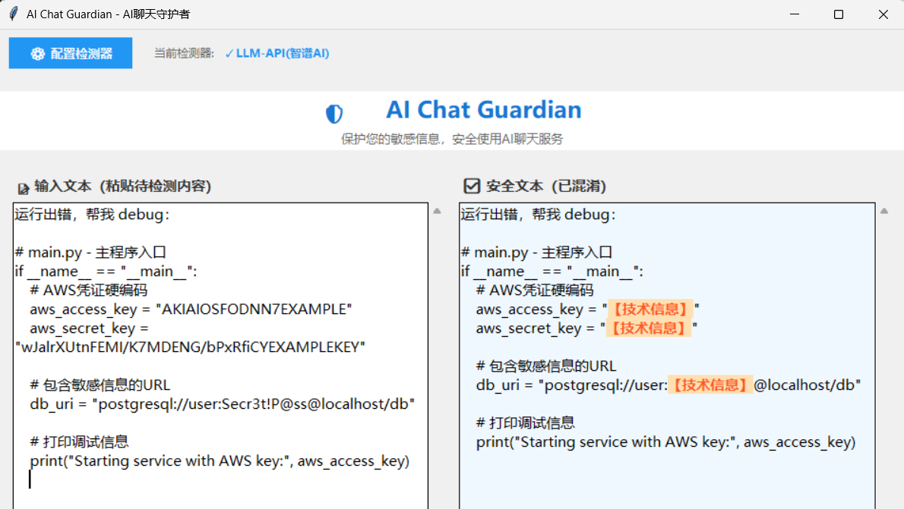
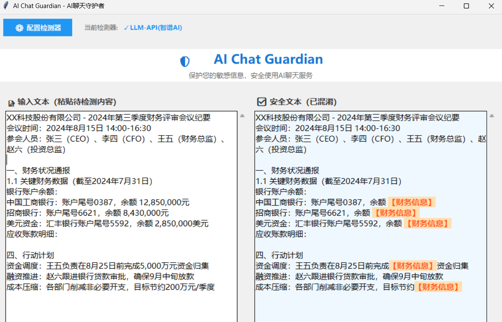
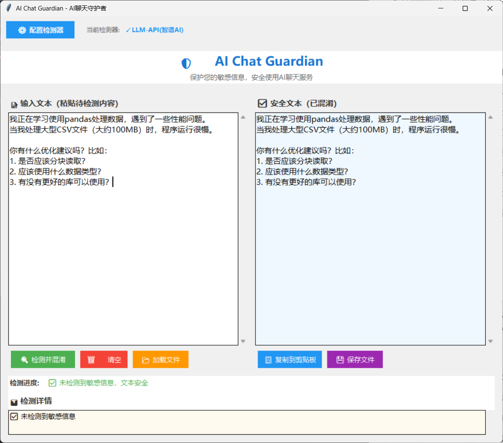
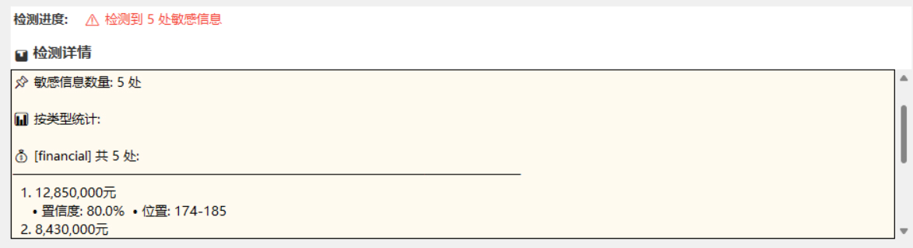

**AI Chat Guardian** 是一个智能敏感信息检测与防护工具。在用户使用ChatGPT等AI工具前，可先通过本系统检测文本内容，**自动识别并混淆**财务数据、技术密钥、人员信息等敏感内容，防止机密信息泄露。

## 1. 背景与问题

### 1.1 AI工具带来的数据泄露风险

随着ChatGPT、Claude等AI大模型工具的普及，企业员工在使用这些工具时，往往会无意识地输入包含敏感信息的内容，导致严重的数据泄露风险。

#### 真实案例：

**案例1: 三星机密代码泄露事件**
- **事件:** 三星员工使用ChatGPT优化代码时，将公司机密源代码上传
- **影响:** 半导体设备测量数据、产品良率信息等核心机密外泄
- **损失:** 企业声誉受损，被迫紧急封禁ChatGPT使用

**案例2: 亚马逊律师泄露客户信息**
- **事件:** 亚马逊律师使用ChatGPT处理法律文件，泄露客户敏感信息
- **影响:** 客户隐私数据外泄，涉及个人身份、财务信息
- **后果:** 面临法律诉讼和巨额赔偿


### 1.2 传统检测方法的局限性

- ❌ **高误报率:** 无法理解语义，"我的工资"和"员工工资50万"都会被误判
- ❌ **低召回率:** 容易被变形绕过，如"5000w"、"五千万"等写法
- ❌ **维护困难:** 需要不断更新规则库，适应新的表达方式
- ❌ **缺乏上下文理解:** 无法判断"今天营收很好"是否真的涉及敏感信息

# 2. AI Chat Guardian 的优势

- 本地大语言模型（Ollama 管理的大语言模型，如 `qwen2:7b`）语义识别：可理解“隐性描述”“跨句推断”等。
- 多层融合（语义 LLM + 规则 + 关键词）提升召回，同时通过去重与阈值控制避免大量误报。
- 混淆脱敏保持原始文本结构与语义大致可读，方便安全审核后继续使用。
- 纯本地运行，数据不出内网，满足合规 / 隐私要求。
- 可配置扩展：敏感类别、关键词库、阈值策略均通过 YAML 快速调整。

# 3. 总体架构



# 4. 大语言模型 Prompt 设计策略

设计了专门的提示词模板，让LLM能够准确识别敏感信息：

```python
You are a corporate data leak detector. Identify sensitive info in the text.

Categories:
- financial: money, revenue, profit, budget, salary
- personnel: employee name, ID, phone, email  
- strategy: confidential projects, business plans
- technical: passwords, keys, IPs, database URLs
- customer: client names, contracts, deals

Text: "{text}"

If sensitive found, reply ONE line per item:
{{"detections":[{{"text":"sensitive content","category":"type"}}]}}
```

**优势:**
- ✅ 简洁清晰，适合小模型理解
- ✅ 结构化输出，易于解析
- ✅ 支持多语言内容检测

设计思想：
- 明示敏感类别：financial / personnel / strategy / technical / customer（可扩展）。
- 约束输出：仅允许返回固定 JSON 结构（数组为空即无敏感项）。
- 原文对齐：要求返回的 `text` 必须与原文字符级一致，便于精确定位与后续脱敏。
- 控制随机性：低温度（如 0.1）+ 限制最大输出 token，保持稳定。


# 5. 功能组件

| 组件 | 作用 | 说明简述 |
|------|------|----------|
| ChatGuardian | 统一入口 | 负责 orchestrate：调用各检测器、合并、去重、脱敏、统计 |
| RegexDetector | 结构化模式 | 邮箱、手机号、证件号、API Key、密钥头、金额组合等 |
| KeywordDetector | 关键词 + 上下文 | 类别权重 + 上下文“加强词”微调置信度 |
| LLMDetector | 本地语义识别 | 识别隐形 / 非格式化 / 跨句潜在敏感信息 |
| AIDetector（可选） | 轻量语义补充 | 安装依赖后可启用零样本或相似度；未启用不影响主流程 |
| Obfuscator | 脱敏处理 | 保留结构，替换部分字符，便于继续业务使用 |
| 配置（YAML） | 策略调优 | 启用/禁用模块、阈值、类别与关键词扩展 |

# 6. 使用演示

- 输入待检测文本



- 泄密代码检测结果



- 财务信息检测结果



- 不含敏感信息的返回结果



- 查看检测详情



# 7. 后续可扩展方向

| 方向 |  说明 |
|------|---------|
| 增量检测缓存 |  重复大文档仅对新增差分段执行 LLM 推理 |
| 自定义类别可视化 |  GUI 中动态开关类别与阈值滑杆 |
| 审计日志链 |  记录检测决策（散列化）便于追溯与安全审计 |
| 片段级解释 | 为命中提供“理由提示”增强信任 |
| 组织策略集成 |  按部门/角色加载不同敏感词/权重方案 |

